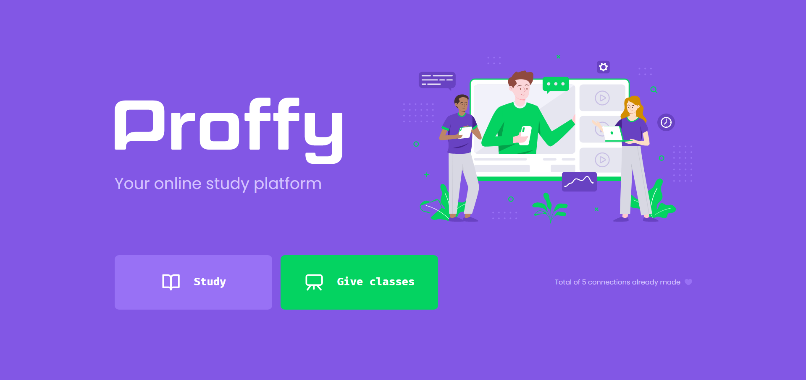
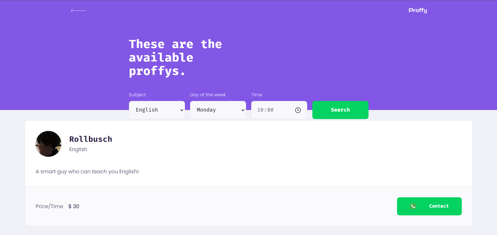
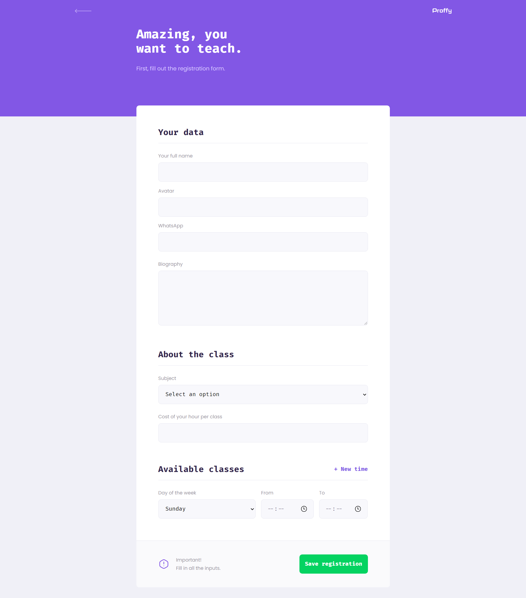
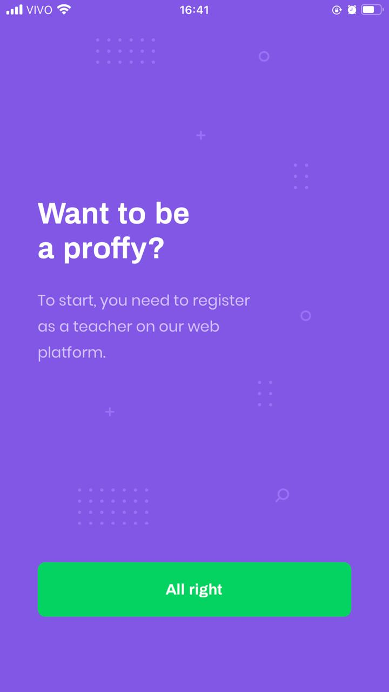

[web-badge]: https://img.shields.io/badge/WEB-6842C2?logo=typescript&logoColor=47248F&label=Proffy&labelColor=6842C2&style=for-the-badge
[backend-badge]: https://img.shields.io/badge/BACKEND-04D361?logo=Node.js&logoColor=03A14A&label=Proffy&labelColor=04D361&style=for-the-badge
[mobile-badge]: https://img.shields.io/badge/MOBILE-494949?logo=react&logoColor=161616&label=Proffy&labelColor=494949&style=for-the-badge

<div align="center" id="top"> 

  <h1 align="center">Proffy</h1>

  &#xa0;

  

  &#xa0;

  [![web][web-badge]](#desktop_computer-web)
  [![backend][backend-badge]](#globe_with_meridians-server)
  [![mobile][mobile-badge]](#iphone-mobile)
 
</div>

<h1 align="center"></h1>
 
<p align="center">
  <a href="#dart-about">About</a> &#xa0; | &#xa0; 
  <a href="#sparkles-features">Features</a> &#xa0; | &#xa0;
  <a href="#rocket-technologies">Technologies</a> &#xa0; | &#xa0;
  <a href="#white_check_mark-requirements">Requirements</a> &#xa0; | &#xa0;
  <a href="#checkered_flag-starting">Starting</a> &#xa0; | &#xa0;
  <a href="#memo-license">License</a> &#xa0;
</p>

<br>

## :dart: About ##

Study platform using **React** that connects teachers and students.

&#xa0;

## :sparkles: Features ##

✔️ Responsive layout;\
✔️ Register student;\
✔️ Register teacher;\
✔️ Favorite teacher;

&#xa0;

## :rocket: Technologies ##

The following tools were used in this project:

- [Expo](https://expo.io/)
- [Node.js](https://nodejs.org/en/)
- [React](https://pt-br.reactjs.org/)
- [React Native](https://reactnative.dev/)
- [TypeScript](https://www.typescriptlang.org/)

* `Axios` to facilitate the consumption of external APIs;
* Using `react-router-dom` to navigate between pages;
* `SQLite` as database;
* `Knex` to build SQL from JS;
* `Express` framework to create the API responses and requests;

&#xa0;

<div align="center">

## 🖥️ Web

&#xa0;

### Landing page



### Teachers page



### Register page



&#xa0;

## 📱 Mobile

&#xa0;

### Welcome


### Teachers


### Favorites teachers


### Give class



&#xa0;

</div>

## :white_check_mark: Requirements ##

Before starting 🏁, you need to have [Git](https://git-scm.com) and [Node](https://nodejs.org/en/) installed.

&#xa0;

## :checkered_flag: Starting ##

&#xa0;

```bash
# Clone this project
$ git clone https://github.com/marianamorais/proffy

# Access
$ cd proffy

# Install dependencies
$ yarn

# Run the project
$ yarn start

# The server will initialize in the <http://localhost:3000>
```
&#xa0;

## :memo: License ##

&#xa0;

This project is under license from MIT. For more details, see the [LICENSE](LICENSE.md) file.

&#xa0;

<a href="#top">Back to top</a>